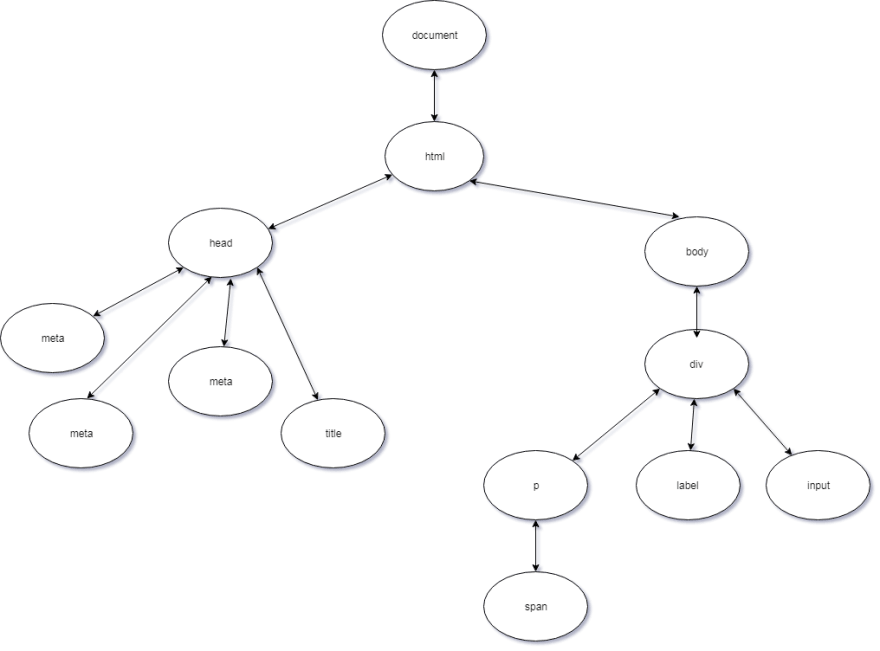

# JavaScript 인터뷰 문제 & 답안

> 해당 사이트의 인터뷰 문제를 참고하여 번역하였습니다.<br/>
> [https://dev.to/macmacky/70-javascript-interview-questions-5gfi](https://dev.to/macmacky/70-javascript-interview-questions-5gfi)
> <br><br/>
> 해당 사이트의 디자인 및 레이아웃을 참고하였습니다.<br/>
> [https://github.com/sudheerj/reactjs-interview-questions](https://github.com/sudheerj/reactjs-interview-questions)

---

### 문제 테이블

| No. | 문제 |
| --- | --------- |
|1    | [undefined와 null의 차이점은 무엇입니까?](#undefined와-null의-차이점은-무엇입니까) |
|2    | [연산자 &&는 무엇입니까?](#연산자-&&는-무엇입니까) |
|3    | [연산자 \|\|는 무엇입니까?](#연산자-\|\|는-무엇입니까) |
|4    | [+ 또는 단항 더하기 연산자를 사용하는 것이 문자열을 숫자로 변환하는 가장 빠른 방법일까?](#+-또는-단항-더하기-연산자를-사용하는-것이-문자열을-숫자로-변환하는-가장-빠른-방법일까) |
|5 | [DOM이란 무엇인가?](#DOM이란-무엇인가) |
|6 | [event Propagation이란 무엇인가?](#event-propagation이란-무엇인가) |
|7 | [event Bubbling이란 무엇인가?](#event-bubbling이란-무엇인가) |
|8 | [event Capturing이란 무엇인가?](#event-capturing이란-무엇인가) |
|9 | [event.preventDefault()와 event.stopPropagation() 함수의 차이점은 무엇인가?](#event.preventDefault()와-event.stopPropagation()-함수의-차이점은-무엇인가?) |
|10 | [event.preventDefault()함수가 요소에서 사용되었는지 어떻게 알 수 있는가?](#event.preventDefault()함수가-요소에서-사용되었는지-어떻게-알-수-있는가?) |
|11 | [obj.someprop.x에서 오류가 발생하는 이유는?](#obj.someprop.x에서-오류가-발생하는-이유는) |
|12 | [event.target은 무엇입니까?](#event.target은-무엇입니까) |
|13 | [event.currentTarget은 무엇입니까?](#event.currentTarget은-무엇입니까) |
|14 | [==와 ===의 차이는 무엇입니까?](#==와-===의-차이는-무엇입니까) |
|15 | [2개의 속성이 같은 객체를 비교할 때 왜 false를 반환하나요?](#2개의-속성이-같은-객체를-비교할-때-왜-false를-반환하나요?) |
|16 | [!!연산자는 무엇입니까?](#!!연산자는-무엇입니까) |
|17 | [한줄에 여러가지 식을 작성하는 방법은?](#한줄에-여러가지-식을-작성하는-방법은) |
|18 | [호이스팅이란 무엇입니까?](#호이스팅이란-무엇입니까) |

### 답안

1. ### undefined와 null의 차이점은 무엇입니까?

    undefined와 null은 JavaScript의 7개의 기본적인 타입이다.
    
    undefined와 null의 값은 false를 가진다. 이는 ( !!value ) 등을 통해 확인할 수 있다.
    ``` javascript
    console.log(!!null); //logs false
    console.log(!!undefined); //logs false
    ```

    undefined는 특정 값이 할당되지 않은 변수의 기본값이다.
    보통 선언만 하고 초기화를 하지 않은 경우에 undefined 값을 가지게된다.
    ``` javascript
    let test;
    const doNothing = () => {};

    console.log(test); //logs undefined
    console.log(doNothing()); //logs undefined
    ```
    
    null은 일종의 '값이 없는 값'이다. 명시적으로 정의된 타입 중 하나이다.
    여기서 fs.readFile 메소드가 오류를 발생시키지 않으면 null 값을 얻는다.
    ``` javascript
    var test = null;
    console.log(test);

    fs.readFile('path/to/file', (e,data) => {
      console.log(e); //it logs null when no error occurred
      console.log(data);
    });
    ```


    **[⬆ Back to Top](#문제-테이블)**
    
2. ### 연산자 &&는 무엇입니까?

    **논리 연산자**의 AND 라고 하며, 논리 연산자는 보통 Boolean(논리적) 값과 함께 쓰이며, 불리언 값을 반환한다.
    첫번째 표현식이 거짓이면 첫번째 표현식을 반환하며, 참이면 두번째 표현식을 반환한다.

    conMobile의 값이 존재한다면 true를 반환한다. 때문에 release()함수를 수행할 수 있다. if 대신 && 연산자를 사용해서 진행할 수 있다.
    ``` javascript
    // if문 사용
    if (conMobile) {
      conMobile.release();
    }

    // && 연산자 사용
    conMobile && conMobile.release();
    ```

    **[⬆ Back to Top](#문제-테이블)**

3. ### 연산자 ||는 무엇입니까?

    **논리 연산자**의 OR 라고 하며, 논리 연산자는 보통 Boolean(논리적) 값과 함께 쓰이며, 불리언 값을 반환한다.
    첫번째 표현식이 거짓이면 두번째 표현식을 반환하며, 참이면 첫번째 표현식을 반환한다.
    
    null은 false값을 가지고 1은 true값을 가진다. 때문에 1이 먼저 반환되고, undefined와 다시 || 연산을 수행한다. undefined는 false값을 가지기에 true값인 1이 리턴된다.
    ``` javascript
    console.log(null || 1 || undefined); //logs 1
    ```

    인자 name에 어떤 값도 주지 않았기 때문에 name은 undefined이며, undefined는 false 이므로 ||연산자에 의해 'Mark'를 반환한다.
    ``` javascript
    function logName(name) {
      var n = name || "Mark";
      console.log(n);
    }

    logName(); //logs "Mark"
    ```

    **[⬆ Back to Top](#문제-테이블)**
    

4. ### 단항 더하기 연산자를 사용하는 것이 숫자를 문자열로 변환하는 가장 빠른 방법일까?

    MDN Documentation에 의하면 `+`를 통한 변환은 숫자를 문자열로 변경하는 가장 빠른 방법이다. 왜냐하면 이미 숫자인 경우, 값에 대하여 어떤한 동작도 수행하지 않기 때문이다.

    ```javascript
    console.log(+'3'); // logs 3
    ```

    **[⬆ Back to Top](#문제-테이블)**

5. ### DOM이란 무엇인가?

    DOM 은 Document Object Model을 의미하며 HTML 및 XML 문서를위한 인터페이스 ( API ) 이다. 브라우저가 HTML문서를 처음 읽을 때(또는 파싱) 큰 개체를 생성한다. 이 때 HTML 문서를 기반으로하는 이 개체가 DOM이다.

    HTML 문서에서 모델링 된 트리와 같은 구조라고 할 수 있으며, 페이지의 콘텐츠 및 구조, 그리고 스타일 등에 대한 조작에 대한 인터페이스를 제공한다.

    ```html

    <html lang="en">
      <head>
        <meta charset="UTF-8">
        <meta name="viewport" content="width=device-width, initial-scale=1.0">
        <meta http-equiv="X-UA-Compatible" content="ie=edge">
        <title>Document Object Model</title>
      </head>

      <body>
        <div>
          <p>
            <span></span>
          </p>
          <label></label>
          <input>
        </div>
      </body>
    </html>
    ```

    

**[⬆ Back to Top](**#문제-테이블**)**

6. ### event Propagation이란 무엇인가?

    이벤트 전파(event propagation)란 이벤트가 발생한 태그에서 이벤트가 상위 하위 태그에게로 전파되는 현상을 뜻한다.
    이벤트 전파에는 세 단계가 있습니다.

    1. 캡처(Capturing) 단계 - 이벤트가 window로부터 타겟 요소까지 내려가는 현상
    2. 목표(target) 단계 - 이벤트가 목표 요소에 도착하는 것
    3. 버블링(bubbling) 단계 - 이벤트가 목표요소로부터 window까지 퍼져가는 현상

    **[⬆ Back to Top](#문제-테이블)**

7. ### event Bubbling이란 무엇인가?

    이벤트가 DOM 요소에서 발생했을 때, 이벤트가 타겟 요소로부터 window 까지 퍼져나가는 현상이다.

    코드에서 child 요소에 이벤트가 발생했을 시, child -> parent -> grandparent 순으로 이벤트 버블링이 발생한다.

    ``` javascript
    <div class="grandparent">
      <div class="parent">
        <div class="child">1</div>
      </div>
    </div>
    ```

    **[⬆ Back to Top](#문제-테이블)**

8. ### event Capturing이란 무엇인가?

    이벤트가 DOM 요소에서 발생했을 때, 이 이벤트는 하나의 요소에서만 발생하지 않는다.
    Capturing Phase에서는, 이벤트가 window부터 시작하여 이벤트가 발생한 요소까지 전파된다.

    위와 같은 예제로 child에서 이벤트가 발생했을 시, grandparent -> parent -> child 순으로 이벤트가 발생한다.

    ``` javascript
    <div class="grandparent">
      <div class="parent">
        <div class="child">1</div>
      </div>
    </div>
    ```

    **[⬆ Back to Top](#문제-테이블)**

9. ### event.preventDefault()와 event.stopPropagation() 함수의 차이점은 무엇인가?

    `preventDefault()`함수는 요소의 기본동작을 방지한다. 예를 들어 form 태그의 이벤트에서 해당 함수를 실행한다면, submit이라는 form 태그의 기본동작이 작동하지 않는다.

    `stopPropagation()`함수는 이벤트 전파를 중지하거나 버블링 또는 캡처링 단계 에서 이벤트가 발생하지 않도록 한다.

    **[⬆ Back to Top](#문제-테이블)**

10. ### event.preventDefault()함수가 요소에서 사용되었는지 어떻게 알 수 있는가?

    `event.defaultPrevented()`라는 이벤트 객체의 속성을 통해 확인할 수 있다.
    요소에서 사용되었는지 사용되지 않았는지를 이 함수의 bool 리턴값으로 알 수 있다.

    **[⬆ Back to Top](#문제-테이블)**

11. ### obj.someprop.x에서 오류가 발생하는 이유는?

    ``` javascript
    const obj = {};
    console.log(obj.someprop.x);
    ```
    <br/>
    
    obj 객체의 someprop이라는 속성의 value는 undefined이다. 왜냐하면 따로 객체에 선언하지 않았기 때문이다. 선언하지 않은 속성이나 변수를 호출할 경우, javascript는 컴파일 에러가 아닌 undefined를 리턴한다.

    undefined인 someprop에게 x라는 속성의 호출을 요구한다. 당연히 undefined는 속성을 가질 수 없기 때문에 컴파일 오류를 발생시킨다.

    **[⬆ Back to Top](#문제-테이블)**

12. ### event.target은 무엇입니까?

    `e.target`은 이벤트가 발생된 태그 그 자체를 의미한다. 예를 들어 div에서 이벤트가 발생한다면, e.target은 그 div가 될 것이다.

    여기서 three라는 클래스를 가진 div에서 이벤트가 발생한다면, target은 three클래스의 div가 된다.

    ``` javascript
    <div class="one">
      <div class="two">
        <div class="three" onClick="">
        </div>
      </div>
    </div>
    ```

    **[⬆ Back to Top](#문제-테이블)**

13. ### event.currentTarget은 무엇입니까?

    `e.currentTarget` 은 동일하게 이벤트에 대한 태그를 의미하나, 이벤트가 발생한 태그의 최상위 (부모) 태그를 의미한다.

    three에서 이벤트가 발생했지만, currentTarget은 one이 된다.

    ``` javascript
    <div class="one">
      <div class="two">
        <div class="three" onClick="">
        </div>
      </div>
    </div>
    ```

    **[⬆ Back to Top](#문제-테이블)**

14. ### ==와 ===의 차이는 무엇입니까?

    `==`는 얕은 비교로써, 피연산자를 자동으로 형변환하여 비교한다.
    `===`는 형변환없이 그대로 타입과 값을 비교한다.

    == 연산의 경우, 254라는 숫자를 문자열로 변환하여 true를 리턴하게 된다.

    ``` javascript
    254 == '254'      // return true
    'true' == true    // return false
    true == 2         // return false

    254 === '254'     // return false
    ```

    **[⬆ Back to Top](#문제-테이블)**

15. ### 2개의 속성이 같은 객체를 비교할 때 왜 false를 반환하나요?

    ``` javascript
    let a = { a: 1 };
    let b = { a: 1 };
    let c = a;

    console.log(a === b); // logs false even though they have the same property
    console.log(a === c); // logs true hmm
    ```

    객체는 참조에 의해 할당되고 복사되기 때문에, 내부 속성까지 동일해도 선언을 따로 한다면 다른 메모리에서 참조하게된다. 
    참조란, 메모리에서의 객체의 위치를 가리키는 것이다.
    
    때문에 a와 b는 같지 않으며, c의 경우 a의 참조를 똑같이 참조하기 때문에 true를 리턴하게 된다.

    **[⬆ Back to Top](#문제-테이블)**

    

16. ### !!연산자는 무엇입니까?

    !!연산자는, 오른쪽의 값을 bool 타입으로 강제 변환시킨다.
    아래 코드를 참고
    
    ``` javascript
    console.log(!!null); //logs false
    console.log(!!undefined); //logs false
    console.log(!!''); //logs false
    console.log(!!0); //logs false
    console.log(!!NaN); //logs false
    console.log(!!' '); //logs true
    console.log(!!{}); //logs true
    console.log(!![]); //logs true
    console.log(!!1); //logs true
    console.log(!![].length); //logs false
    ```
   
    **[⬆ Back to Top](#문제-테이블)**

17. ### 한줄에 여러가지 식을 작성하는 방법은?
    
    `,`를 통해 한줄에 여러 표현식을 수행할 수 있다. 왼쪽에서 오른쪽으로 수행하며, 마지막 오른쪽 피연산자의 값을 반환한다.

    ``` javascript
    let x = 5;

    x = (x++ , x = addFive(x), x *= 2, x -= 5, x += 10);

    function addFive(num) {
      return num + 5;
    }
    ```
   
    왼쪽 -> 오른쪽으로 진행되므로, `x++` 을 가장 먼저 수행하게 된다.

    1. `x++`로 인해 6 반환
    2. `addFive(6)` 수행하여 11 반환
    3. `x *= 2` 수행하여 22 반환
    4. `x -= 5` 수행하여 17 반환
    5. `x += 10` 수행하여 27 반환

    **[⬆ Back to Top](#문제-테이블)**

18. ### 호이스팅이란 무엇입니까?
    
    변수 또는 함수의 선언부가 코드 최상단으로 끌어올려지는 현상을 의미한다.

    zero가 아래 선언되어있음에도 컴파일 에러가 발생하지 않는 이유는 zero라는 변수가 호이스팅되어 최상단으로 선언부가 끌어올려지기 때문이다.

    ``` javascript
    console.log(zero); // undefined  ( ?? Why ?? )
    var zero = 'zero';
    ```
    ``` javascript
    var zero;
    console.log(zero)

    zero = 'zero';
    ```

    함수도 마찬가지로 선언부가 호이스팅되어 컴파일 에러를 발생시키지 않는다.
   
    ``` javascript
    sayWow();

    function sayWow() {
      console.log('wow');
    }
    ```

    하지만 함수의 경우 함수 표현식으로 작성했을 경우, 호이스팅하여도 컴파일 에러를 발생시키는데, 
    이는 함수 표현식의 경우 선언부만 올라가버릴 시 undefined 값을 가지게되며, undefined의 함수호출은 컴파일 에러를 발생시키기 때문이다.

    ``` javascript
    var sayWow;
    sayWow();
    sayWow = function () {
      console.log('wow');
    }
    ```
    ``` javascript
    var sayWow;
    sayWow();
    sayWow = function () {
      console.log('wow');
    }
    ```

    **[⬆ Back to Top](#문제-테이블)**

    